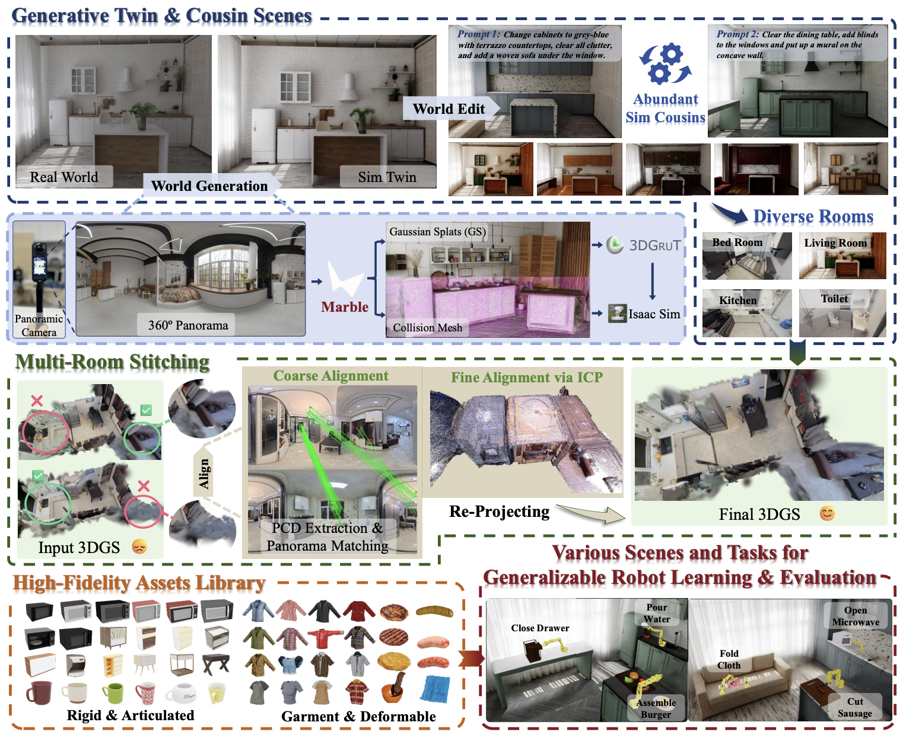

<div align="center">
  <h1>WorldComposer</h1>
  <h3><em>From Seeing to Simulating: Generative High-Fidelity Simulation with Digital Cousins for Generalizable Robot Learning and Evaluation</em></h3>
</div>

<div align="center">
    <a href="https://stubborn111.github.io/WorldComposer/Paper/WorldComposer.pdf" target="_blank">
    </a>
    <a href="https://stubborn111.github.io/WorldComposer/" target="_blank">
    </a>
    <a href="https://github.com/jaber628/WorldComposer" target="_blank">
    </a>
</div>

<div align="center">
  
</div>

<div align="center">
  
</div>

## ✅ **Milestone**

<div align="center">
  
  
  
</div>

**2026.04.17 — WorldComposer Simulation Environment and Real2Sim pipeline release.**

## ✦ **Update List**

<div align="center">
  
  
  
  
  
</div>

- **Simulation Environment** — released.
- **Real2Sim Pipeline** — released.
- **AutoCollection Pipeline** — release in progress.
- **Training and Evaluation Environment** — release in progress.
- **Multiroom Stitching** — release in progress.

## ✦ **Simulation Environment**

### ◆ **Installation**

```bash
conda create -n WorldComposer python=3.11
conda activate WorldComposer

pip install torch==2.7.0 torchvision==0.22.0 --index-url https://download.pytorch.org/whl/cu128
pip install "lerobot[all]==0.4.1"
pip install --upgrade pip
pip install 'isaacsim[all,extscache]' --extra-index-url https://pypi.nvidia.com

cd /home/lightwheel/Projects
git clone <WORLD_COMPOSER_REPO_URL>
cd WorldComposer
python -m pip install -e source/WorldComposer
```

### ◆ **Task Code Structure**

Public tasks are organized under `source/WorldComposer/WorldComposer/tasks/`.

- `Task01_Tableware/`
  - `Tableware.py`: task environment logic, reset behavior, randomization, observations, and success checking.
  - `Tableware_cfg.py`: Isaac Lab environment, robot, object, scene, and camera configuration.
  - `task_config.yaml`: teleoperation and data-collection runtime configuration.
  - `__init__.py`: gym task registration.

Each task follows the same structure: an environment implementation file, a static configuration file, a runtime YAML config, and a registration entry.

### ◆ **Teleoperation**

Use `Teleoperation.sh` to launch the released teleoperation entry.

```bash
bash Teleoperation.sh
```

### ◆ **AutoCollection**

AutoCollection is the automatic data generation pipeline built on top of the same task interface and will be released progressively.

## ✦ **Real2Sim Pipeline**

### ◆ **Overview**

WorldComposer Real2Sim is a complete automated pipeline for point-cloud and mesh alignment, operation-region recognition, operation-surface rectification, and scene-scale / pose alignment, turning real captured scenes into simulation-ready assets.

### ◆ **Installation**

```bash
cd /home/lightwheel/Projects/WorldComposer
mkdir -p 3rd/cache/huggingface 3rd/cache/torch 3rd/cache/xdg

cd 3rd
git clone --recursive https://github.com/nv-tlabs/3dgrut.git
git clone https://github.com/luca-medeiros/lang-segment-anything.git

cd /home/lightwheel/Projects/WorldComposer/3rd/3dgrut
CUDA_VERSION=12 ./scripts/create_conda.sh WorldComposerR2S
conda activate WorldComposerR2S
CUDA_VERSION=12.8.1 ./install_env.sh WorldComposerR2S WITH_GCC11

pip install torch==2.7.0 torchvision==0.22.0 --index-url https://download.pytorch.org/whl/cu128
pip install --upgrade pip
pip install 'isaacsim[all,extscache]' --extra-index-url https://pypi.nvidia.com
pip install open3d trimesh opencv-python segment-anything
pip install -e /home/lightwheel/Projects/WorldComposer/3rd/lang-segment-anything

cd /home/lightwheel/Projects/WorldComposer
python -m pip install -e source/WorldComposer
```

### ◆ **Released Entry**

The current public release exposes `source/WorldComposer/WorldComposer/real2sim/scene_assembler.py` and `Real2Sim.sh` for the scene assembly stage.

### ◆ **Run**

```bash
bash Real2Sim.sh
```


### ◆ **Current Public Scope**

The current release covers PLY-to-USDZ conversion, GLB-to-USD mesh conversion, and composed simulation scene generation.
